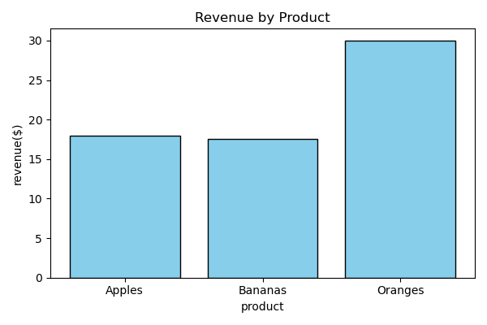

# Basic Sales Summary with SQLite & Python

## Overview
A simple Python project that:
- Creates an SQLite database (`sales_data.db`)
- Inserts sample sales data
- Runs SQL queries to calculate total quantity and revenue per product
- Displays results in the console and as a bar chart (`sales_chart.png`)

## Tools
- Python 3
- SQLite3
- Pandas
- Matplotlib

## How to Run
1. **Create database & insert data**  
   Run `create_database.py`
2. **Query & plot chart**  
   Run `query_and_plot.py`

## Files
- `sales_chart.png` – Revenue chart
- `screenshots` – Code & output images

## Example Output

product total_qty revenue

0 Apples 15 18.0

1 Bananas 22 17.6

2 Oranges 20 30.0

